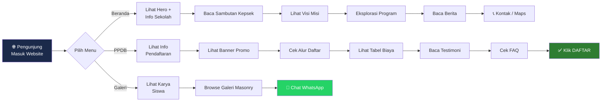
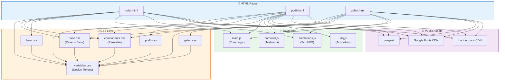
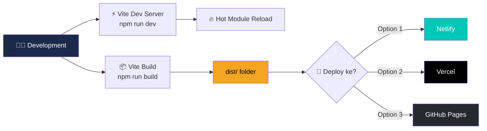
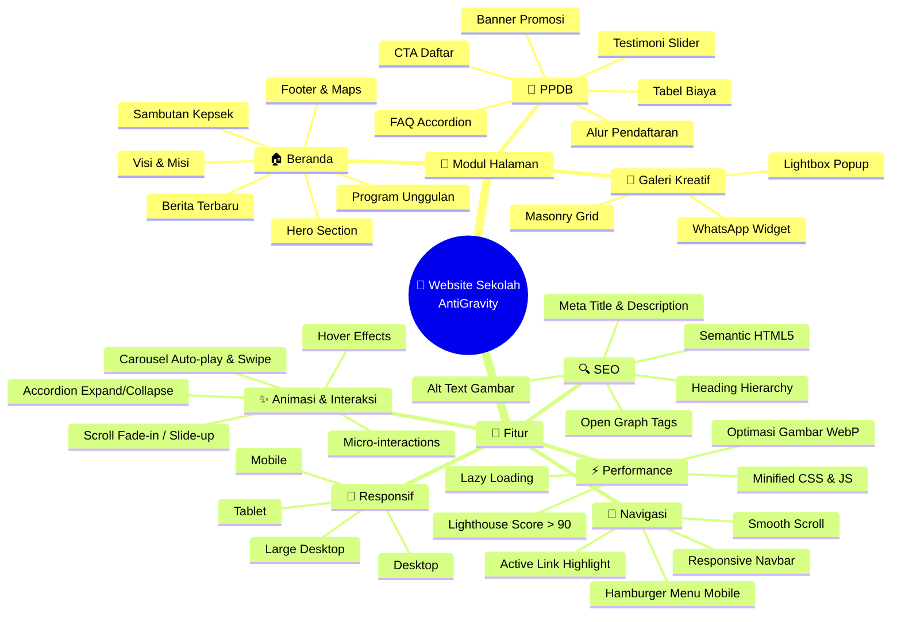

# 🏗️ Arsitektur & Alur Website Sekolah

## Sitemap — Struktur Navigasi

```mermaid
graph TD
    HOME["🏠 Beranda<br>(index.html)"]
    PPDB["📝 PPDB<br>(ppdb.html)"]
    GALERI["🎨 Galeri Kreatif<br>(galeri.html)"]

    HOME --> HERO["Hero Section"]
    HOME --> SAMBUTAN["Sambutan Kepsek"]
    HOME --> VISIMISI["Visi & Misi"]
    HOME --> PROGRAM["Program Unggulan"]
    HOME --> BERITA["Berita Terbaru"]
    HOME --> FOOTER["Footer + Maps"]

    PPDB --> BANNER["Banner Promosi"]
    PPDB --> CTA["CTA Daftar Sekarang"]
    PPDB --> ALUR["Alur Pendaftaran"]
    PPDB --> BIAYA["Tabel Biaya"]
    PPDB --> TESTI["Testimoni Slider"]
    PPDB --> FAQ["FAQ Accordion"]

    GALERI --> MASONRY["Galeri Masonry"]
    GALERI --> ANIMASI["Scroll Animations"]
    GALERI --> WA["WhatsApp Widget"]

    style HOME fill:#1B2A4A,color:#fff
    style PPDB fill:#2E7D32,color:#fff
    style GALERI fill:#E65100,color:#fff
```

---

## Alur Pengunjung (User Flow)

---

## Arsitektur File & Dependency

---

## Alur Build & Deploy

---

## 🧠 Mindmap — Modul & Fitur

