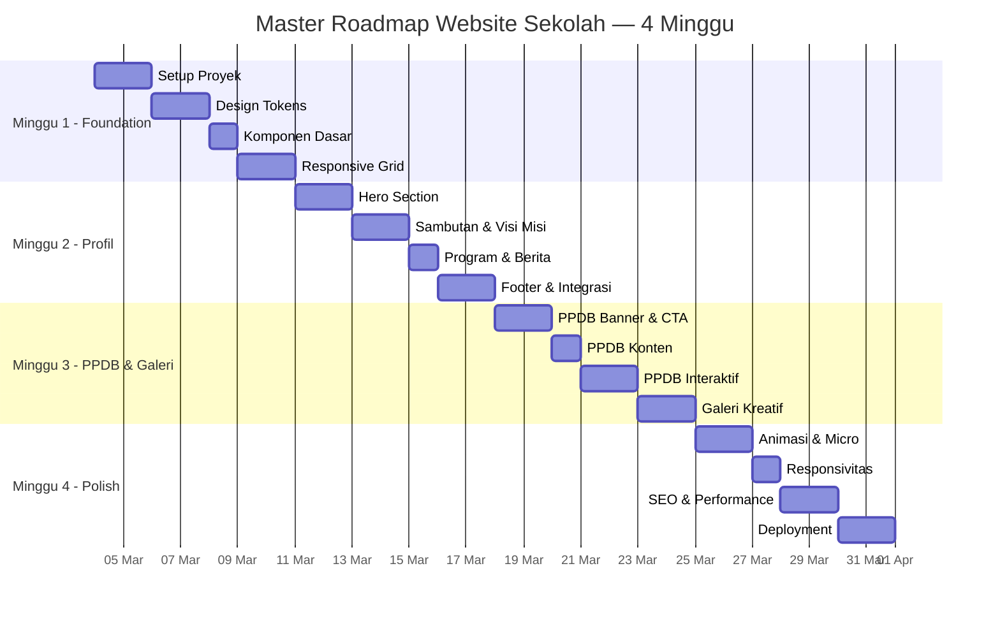

# 🗺️ Master Roadmap — Website Sekolah AntiGravity

> **Durasi:** 4 Minggu | **4 Fase per Minggu**
> **Target:** Website sekolah lengkap (Profil + PPDB + Galeri Kreatif)

---

## 📅 Minggu 1 — Foundation & Design System

### Fase 1.1 — Setup Proyek
- [x] Inisialisasi project Vite (`npm create vite@latest`)
- [x] Buat struktur folder (`src/`, `src/css/`, `src/js/`, `public/images/`)
- [x] Install dependencies (vite)
- [x] Konfigurasi `vite.config.js` untuk multi-page
- [x] Setup Git repository & `.gitignore`

### Fase 1.2 — Design Tokens
- [x] Buat `variables.css` — warna, spacing, typography, shadows
- [x] Buat `base.css` — CSS reset, body defaults, smooth scroll
- [x] Import Google Fonts (Poppins + Inter)
- [x] Tes variabel di browser (warna & font tampil benar)

### Fase 1.3 — Komponen Dasar
- [x] Buat `components.css` — `.btn-primary`, `.btn-secondary`
- [x] Buat komponen `.card` (shadow, hover effect)
- [x] Buat `.section-heading` (title + subtitle styling)
- [x] Buat Navbar (logo, menu links, responsive)
- [x] Buat Footer skeleton (alamat, links, copyright)

### Fase 1.4 — Responsive Grid
- [x] Setup CSS Grid & Flexbox utilities
- [x] Definisikan breakpoints (mobile, tablet, desktop)
- [x] Test layout di 3 viewport sizes
- [x] Fix bug responsive jika ada

**✅ Milestone Minggu 1:** Design system & komponen dasar siap digunakan.

---

## 📅 Minggu 2 — Halaman Utama (Profil Sekolah)

### Fase 2.1 — Hero Section
- [x] Buat HTML structure hero (`index.html`)
- [x] Tambahkan background image full-width
- [x] Overlay gradient + teks "Membangun Generasi Unggul dan Berkarakter"
- [x] Tombol CTA "Jelajahi Program"
- [x] Responsif di mobile (teks resize, tombol full-width)

### Fase 2.2 — Sambutan & Visi Misi
- [x] Layout 2 kolom: foto kepsek (kiri) + teks sambutan (kanan)
- [x] Responsive: stack vertikal di mobile
- [x] Section Visi & Misi dengan grid ikon
- [x] Animasi fade-in saat scroll ke section

### Fase 2.3 — Program & Berita
- [x] Card grid 3 kolom: Ekstrakurikuler, Lab, Perpustakaan Digital
- [x] Setiap card: ikon, judul, deskripsi singkat
- [x] 3 kartu berita terbaru (thumbnail, judul, tanggal, excerpt)
- [x] Hover effect pada card (scale + shadow)

### Fase 2.4 — Footer & Integrasi
- [x] Embed Google Maps iframe
- [x] Link media sosial (Instagram, Facebook, YouTube)
- [x] Teks copyright
- [x] Navigasi antar halaman berfungsi (navbar links)
- [x] Full-page test `index.html` — semua section terhubung

**✅ Milestone Minggu 2:** Halaman profil sekolah (`index.html`) selesai 100%.

---

## 📅 Minggu 3 — PPDB & Galeri Kreatif

### Fase 3.1 — PPDB Banner & CTA
- [x] Buat `ppdb.html` — struktur dasar
- [x] Banner promosi: gradient eye-catching + info diskon/beasiswa
- [x] Tombol "DAFTAR SEKARANG" besar & kontras
- [x] Sticky CTA button di mobile (fixed bottom)
- [x] Test visual banner di 3 viewport

### Fase 3.2 — PPDB Konten
- [x] Infografis alur pendaftaran (timeline horizontal, 4-5 step)
- [x] Tabel rincian biaya pendidikan (Gelombang 1 vs Gelombang 2)
- [x] Layout responsif untuk tabel biaya (scrollable)
- [x] Animasi reveal pada setiap tahapan alur
mobile (horizontal scroll/stack)

### Fase 3.3 — PPDB Interaktif
- [x] Buat `carousel.js` — slider testimoni
- [x] Testimoni alumni (3-4 slide, auto-play)
- [x] FAQ Accordion (pertanyaan umum + jawaban)
- [x] Animasi smooth transition pada accordion
 expand/collapse
- [ ] 5-7 pertanyaan FAQ seputar pendaftaran
- [ ] Animasi smooth open/close

### Fase 3.4 — Galeri Kreatif
- [x] Buat `galeri.html` — struktur dasar
- [x] Masonry grid layout (CSS columns / grid)
- [x] 8-12 gambar galeri (AI generated / placeholder)
- [x] Floating WhatsApp button (pojok kanan bawah)
- [x] Buat `animations.js` — Intersection Observer scroll FX

**✅ Milestone Minggu 3:** PPDB (`ppdb.html`) & Galeri (`galeri.html`) selesai.

---

## 📅 Minggu 4 — Polish, Testing & Deployment

### Fase 4.1 — Animasi & Micro-interactions
- [x] Scroll-triggered fade-in/slide-up untuk semua section
- [x] Hover effects pada semua button & card (underline animation)
- [x] Smooth transition pada navbar & active link tracking
- [x] Refinement pada global variables (shadows & spacing)
- [x] Review semua animasi — hapus yang berlebihan

### Fase 4.2 — Responsivitas & Cross-browser
- [x] Test di Chrome, Firefox, Edge
- [x] Test di mobile Chrome & Safari
- [x] Fix semua bug layout responsive
- [x] Test navigasi antar halaman (semua link benar)
- [x] Test semua interaksi (carousel, FAQ, WhatsApp)

### Fase 4.3 — SEO & Performance
- [x] Tambahkan meta title & description per halaman
- [x] Tambahkan Open Graph meta tags (OG tags)
- [x] Verifikasi heading hierarchy (h1 > h2 > h3)
- [x] Alt text pada semua gambar (SEO friendly)
- [x] Lazy loading gambar (`loading="lazy"`)
- [x] Run Lighthouse audit — target score > 90
- [x] Optimasi gambar (kompresi, placeholder premium)

### Fase 4.4 — Deployment & Documentation
- [x] `npm run build` — verifikasi build sukses
- [x] Test production build secara lokal
- [x] Final QA — browse semua halaman di local dev
- [x] Update dokumentasi final (`walkthrough.md`)
- [x] Bersihkan kode dari bagian testing/debug
- [x] 🎉 **PROJECT COMPLETE!**

**✅ Milestone Minggu 4:** Website dipoles secara premium & siap untuk handover.

---

## 📊 Ringkasan Timeline

---

## 📈 Progress Tracker

| Minggu | Fase 1 | Fase 2 | Fase 3 | Fase 4 | Status |
|--------|--------|--------|--------|--------|--------|
| **1** Foundation | ✅ | ✅ | ✅ | ✅ | Selesai |
| **2** Profil | ✅ | ✅ | ✅ | ✅ | Selesai |
| **3** PPDB & Galeri | ✅ | ✅ | ✅ | ✅ | Selesai |
| **4** Polish | ✅ | ✅ | ✅ | ✅ | Selesai |

> **Legend:** ⬜ Belum | 🔲 Sedang | ✅ Selesai
